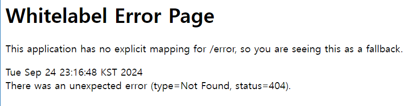

# 1주차 스터디에 배운 내용

## 웹

웹이란 여러 컴퓨터가 서로 연결되어 정보를 공유하는 공간이다. 웹에서 컴퓨터는 클라이언트-서버 패러다임 형대로 서로 정보를 주고 받는다.

## 클라이언트, 서버

클라이언트는 데이터의 생성, 조회, 수정, 삭제 요청을 전송하고 서버는 클라이언트의 요청대로 동작을 수행하고 응답을 전송한다.

## HTTP

컴퓨터가 서로 정보를 공유할 때는 정해진 규칙이 필요한데, 프로토콜이란 네트워크 안에서 요청과 응답을 보내는 규칙으로 웹에서는 HTTP라는 프로토콜을 사용한다

## 프론트엔드, 백엔드

프론트는 화면에 채울 컨텐츠 데이터를 백엔드에게 요청하고 백엔드는 DB에서 가져온 컨텐츠 데이터를 프론트에게 응답한다.

## API

API란 어플리케이션에서 원하는 기능을 수행하기 위해 어플리케이션과 소통하는 구체적인 방법을 정의한 것이다

## API 명세서

- 할 일 생성: POST /todo
- 할 일 조회: GET /todo/list
- 할 일 수정: PATCH /todo/{todo_id}
- 할 일 삭제:DELETE /todo/{todo_id}
- 할 일 체크:POST /todo/{todo_id}/check
- 할 일 체크 해제:POST /todo/{todo_id}/uncheck
- 로그인 POST /login
- 회원가입 POST /signup
- 친구 추가 POST /friend/{friendId}
- 친구 조회 GET /friend/list
- 친구 삭제 DELETE /friend/{friendId}
- 특정 친구의 할 일 조회 GET /friend/{friendId}/todo/list

# 어플리케이션 실행 사진

- 
